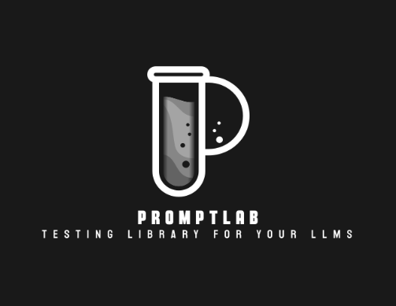

<p align="center">
  
</p>

<p align="center">
  <strong>CI/CD for LLM Applications</strong><br>
  Test prompts at every pipeline stage. Catch regressions before production.<br>
  Evaluate with an LLM Council, not a single biased judge.
</p>

<p align="center">
  
  
  
</p>

---

## 🎯 What is PromptLab?

PromptLab is a **CI/CD framework for LLM applications** that provides automated testing and validation for your AI systems. Think of it as GitHub Actions for prompts - every change to your LLM's behavior gets tested automatically before it reaches production.

### The Problem

You're building an LLM-powered application. You have system prompts (Behavior Specification Prompts or BSPs) in production. You make changes to improve responses, add new capabilities, or fix issues.

**But how do you know your changes didn't break something?**

- Manual testing is time-consuming and inconsistent
- Single-model evaluation is biased
- No baseline tracking means no regression detection
- Production failures are expensive

### The Solution

PromptLab provides:
- **Automated test generation** from web scraping
- **Multi-model council evaluation** for unbiased scoring
- **Baseline tracking** to prevent regressions
- **CI/CD integration** for GitHub Actions
- **Batch evaluation** for efficient API usage

---

## ⚡ Quick Start

### Installation

Install PromptLab from PyPI:
```bash
pip install promptlab
```

Or from source:
```bash
git clone https://github.com/Arnav9923386924/Promptlab.git
cd promptlab
pip install -e .
```

### Basic Setup

1. **Initialize Project**
   ```bash
   promptlab init
   ```
   Creates configuration files and directory structure

2. **Setup Provider**
   - Local (Ollama): `promptlab setup ollama`
   - Cloud (OpenRouter): `promptlab setup openrouter --api-key YOUR_KEY`

3. **Run Validation**
   ```bash
   promptlab validate
   ```

That's it! Your first validation runs automatically.

---

## 🏛️ LLM Council: Multi-Model Evaluation

### Why Council-Based Evaluation?

**Single LLM-as-judge = biased evaluation**

When you use one model to judge another, you get bias toward that model's style, knowledge cutoff, and training preferences. A response that perfectly matches GPT-4's style might score high from GPT-4 but fail real-world requirements.

**LLM Council = democratic, multi-perspective evaluation**

Inspired by Andrej Karpathy's work on multi-model consensus, PromptLab uses multiple diverse models to evaluate outputs. Each "council member" brings different biases, which cancel out through aggregation.

### How It Works

```
STAGE 1: Independent Judging
┌────────┐  ┌────────┐  ┌────────┐
│ Llama  │  │ Gemma  │  │ Mistral│
│ 0.82   │  │ 0.75   │  │ 0.78   │
└────────┘  └────────┘  └────────┘
                │
STAGE 2: Cross-Critique (Optional)
"Judge A's score seems high because..."
                │
STAGE 3: Chairman Synthesis
┌─────────────────────────────────────┐
│ Final Score: 0.78                   │
│ Confidence: HIGH                    │
│ Consensus: "Accurate but verbose"   │
└─────────────────────────────────────┘
```

#### Stage 1: Independent Judging
Each council member independently evaluates all test outputs on multiple dimensions:
- **Role Adherence**: Does the LLM follow its BSP instructions?
- **Response Quality**: Are answers accurate, helpful, and well-formatted?
- **Consistency**: Are responses consistent across similar prompts?
- **Appropriateness**: Does the LLM stay within its defined scope?

#### Stage 2: Cross-Critique (Optional)
Council members review each other's scores and provide critiques. This catches outlier judgments and adds self-correction.

#### Stage 3: Chairman Synthesis
A designated "chairman" model reviews all scores and critiques, then produces:
- **Final Score**: Weighted consensus (0.0 to 1.0)
- **Confidence Level**: High/Medium/Low based on agreement
- **Consensus Summary**: What the council agreed on
- **Disagreements**: Where judges differed and why

### Council Modes

| Mode | Stages | Speed | Use Case |
|------|--------|-------|----------|
| **Full** | All 3 | Slow | Critical production deployments, compliance validation |
| **Fast** | 2 (skip critique) | Medium | Regular testing, CI/CD pipelines (recommended) |
| **Vote** | Just majority | Fast | Quick sanity checks, rapid prototyping |

### Batch Evaluation Optimization

Traditional approach: Evaluate each test individually
- 50 tests × 3 council members = **150 API calls** ❌

PromptLab's approach: Batch evaluation
- Submit all 50 outputs once to each judge = **3 API calls** ✅

This reduces costs by **50x** and speeds up validation significantly.

---

## 🔍 BSP Validation

### What is a BSP?

A **Behavior Specification Prompt (BSP)** is your LLM's system prompt - the instructions that define how it should behave. It includes:
- Role definition and expertise areas
- Response formatting rules
- Safety guardrails and disclaimers
- Style and tone guidelines
- Scope limitations

### BSP Validation Workflow

```
1. Load BSP from config/file
   ↓
2. Check for existing tests
   ↓
3. If no tests → Auto-generate via web scraping
   ↓
4. Run all tests with BSP prepended
   ↓
5. Collect outputs → Batch file
   ↓
6. Submit to LLM Council for evaluation
   ↓
7. Compare score with baseline
   ↓
8. If improved → Update baseline → Commit → Push
```

### Configuration Structure

BSP validation uses `promptlab.yaml` configuration with these key sections:

**BSP Settings**
- Define prompt inline or reference external file
- Set minimum passing score
- Version tracking
- Auto-generation toggle
- Test count control

**Model Configuration**
- Default model for test execution
- Provider setup (Ollama, OpenRouter, etc.)
- API key management via environment variables

**Council Setup**
- Enable/disable council
- Choose mode (full/fast/vote)
- Select member models
- Designate chairman

**Testing Options**
- Parallel execution control
- Timeout configuration
- Retry logic

**Baseline Management**
- Auto-update on improvement
- Minimum improvement threshold
- History tracking

**Git Integration**
- Auto-commit improved baselines
- Custom commit messages
- Optional auto-push

**Scraper Configuration**
- Search provider selection
- Page limits
- Timeout settings

---

## 🌐 Web Scraping & Test Generation

### Automatic Test Generation

PromptLab eliminates manual test writing through intelligent web scraping and test generation.

### Process Flow

When you run validation without existing tests:

1. **BSP Analysis** → Extracts domain, keywords, capabilities
2. **Query Generation** → Creates targeted search queries
3. **Web Scraping** → Fetches relevant content
4. **Content Parsing** → Extracts facts and Q&A pairs
5. **Test Creation** → Generates YAML test files

### Technology Stack

| Component | Technology | Purpose |
|-----------|------------|----------|
| **HTTP Client** | httpx (HTTP/2) | Fast parallel requests |
| **Browser** | Playwright + stealth | JavaScript rendering, bot bypass |
| **HTML Parser** | selectolax | 5-10x faster parsing |
| **Search** | SearXNG/SerpAPI | Dynamic URL discovery |

### Hybrid Scraping Approach

```
1. Try httpx (fast) → 2. Detect JS needs → 3. Fallback to Playwright
```

### Search Provider Options

| Provider | Auth | Rate Limits | Quality |
|----------|------|-------------|---------|
| SerpAPI | Free API key | 100/month | ⭐⭐⭐⭐⭐ |
| SearXNG | None | Unlimited | ⭐⭐⭐⭐ |
| Brave | Credit card | 2,000/month | ⭐⭐⭐⭐ |
| DuckDuckGo | None | Sometimes limited | ⭐⭐⭐ |
| Google Scrape | None | Often blocked | ⭐⭐ |

**Recommendation**: SerpAPI for best results (free tier available)

### Test Types Generated

**Q&A Tests**
- Extract question-answer pairs from content
- Validate factual accuracy
- Test domain knowledge

**Cloze Tests**
- Mask important terms in sentences
- Test terminology understanding
- Validate completeness

### Integration

Auto-scraping triggers when:
- No test files in `temp/`
- `bsp.auto_generate` enabled
- BSP file present

Manual scraping available via `promptlab scrape` command for:
- Specific subtopics
- Additional coverage
- Preview before validation

---

## 🚀 CI/CD Integration

### GitHub Actions Setup

PromptLab provides automatic workflow generation via `promptlab ci-setup`.

### Generated Workflow Features

**On Pull Requests**
- Validates every PR automatically
- Posts results as comments
- Blocks merge on failure
- Fast feedback loop

**On Main Branch**
- Post-merge validation
- Automatic baseline updates
- Commits improvements
- Optional remote push

**Infrastructure**
- Auto-installs dependencies
- Configures provider (Ollama/OpenRouter)
- Uploads result artifacts
- Provides status checks

### Provider Options

**Local Models (Ollama)**
- Zero cost
- Complete privacy
- No network latency
- Unlimited usage

**Cloud Models (OpenRouter)**
- Easy setup
- 100+ model access
- Free tier available
- High throughput

Configuration via GitHub Secrets for API keys.

---

## 🎚️ Understanding Council Modes

### Full Mode
**Best for**: Critical validations, compliance, production

**Process**: Independent judging → Cross-critique → Chairman synthesis

**Tradeoffs**: Most accurate, slowest, highest cost

### Fast Mode (Recommended)
**Best for**: Regular development, CI/CD, iterative testing

**Process**: Independent judging → Chairman synthesis

**Tradeoffs**: Good accuracy, reasonable speed, moderate cost

### Vote Mode
**Best for**: Quick checks, sanity testing, prototyping

**Process**: Independent judging → Majority vote

**Tradeoffs**: Fastest, cheapest, less nuanced

---

## 📊 Baseline Tracking

### How It Works

**Initial Run**
- Establishes baseline score
- Saves to `.promptlab/baselines/`
- Stores metadata

**Subsequent Runs**
- Compares new score vs baseline
- Calculates improvement/regression
- Updates if improved

**Auto-Update Logic**
- Only updates on improvement
- Optional minimum threshold
- Preserves history

### Use Cases

**Regression Detection**
- Catch quality reductions
- Alert on degradation
- Maintain standards

**Progress Tracking**
- Monitor improvement trends
- Visualize score history
- Identify best configs

**A/B Testing**
- Compare BSP versions
- Test configurations
- Validate optimizations

---

## 🛠️ Provider Support

PromptLab works with multiple LLM providers:

**Local Inference**
- Ollama (unlimited, private, free)

**Cloud APIs**
- OpenRouter (100+ models, pay-as-you-go)
- OpenAI (GPT models)
- Anthropic (Claude models)
- Google (Gemini models)
- xAI (Grok models)

Switch providers without code changes via configuration.

---

## 📦 Model Recommendations

### Development (Free Options)

**Local Ollama**
- Llama 3.1 8B (fast, capable)
- Mistral 7B (good reasoning)
- Gemma 2 9B (quality responses)

**OpenRouter Free Tier**
- Meta Llama 3.3 70B (high quality)
- Meta Llama 3.1 8B (fast)
- Google Gemma models (diverse)

### Production (Paid Options)

**High Quality Council**
- OpenAI GPT-4o Mini ($0.15/1M tokens)
- Google Gemini Flash 1.5 ($0.075/1M tokens)
- Anthropic Claude 3.5 Sonnet (premium)

**Cost-Effective Strategy**
- Mix free and paid models
- Free for initial judging
- Paid for chairman synthesis

---

## 🔧 Common Issues & Solutions

### Rate Limiting
**Symptom**: 429 errors, "Rate limited after 5 retries"

**Solutions**:
- Switch to different free models
- Use local Ollama (unlimited)
- Reduce parallelism
- Add request delays
- Upgrade to paid tier

### Empty Model Responses
**Symptom**: Council score always 0.50

**Solutions**:
- Test models individually with curl
- Verify models return content
- Check model availability
- Review rate limit status

### Provider Errors
**Symptom**: "Unknown provider" messages

**Solutions**:
- Verify model path format (include provider prefix)
- Check provider configuration
- Validate API keys
- Review model availability

### Encoding Issues
**Symptom**: Unicode errors on Windows

**Solutions**:
- Set UTF-8 environment encoding
- Configure console output encoding
- Use PowerShell instead of CMD

### Authentication Failures
**Symptom**: 401/403 API errors

**Solutions**:
- Use environment variables for keys
- Verify key validity
- Check provider account status
- Review permission scopes

---

## 📈 Best Practices

### Development Workflow
1. Start with local Ollama to avoid costs
2. Validate small BSP changes frequently
3. Review score trends regularly
4. Use fast mode for iteration

### Council Configuration
1. Use diverse models from different providers
2. Mix model sizes for balanced evaluation
3. Choose reliable chairman model
4. Test council members individually first

### BSP Management
1. Version your BSPs with semantic versioning
2. Document changes in commit messages
3. Track improvement over time
4. Set realistic minimum scores

### Security
1. Never commit API keys
2. Use environment variables
3. Rotate keys periodically
4. Limit key permissions

### Testing Strategy
1. Start with auto-generated tests
2. Add custom tests for edge cases
3. Maintain test diversity
4. Review failed test outputs

### CI/CD Integration
1. Enable on PRs for fast feedback
2. Block merges on failures
3. Auto-update baselines on main
4. Archive validation artifacts

### Cost Optimization
1. Use batch evaluation (built-in)
2. Prefer fast mode over full
3. Use free models in development
4. Reserve paid models for production

---

## 🚀 Roadmap

**Completed**
- ✅ Core framework with multi-provider support
- ✅ Council evaluation with batch processing
- ✅ Web scraping and auto-test generation
- ✅ Baseline tracking and git integration
- ✅ GitHub Actions CI/CD workflows
- ✅ BSP validation workflow

**In Progress**
- 🔄 VS Code extension for integrated testing
- 🔄 Production log capture and replay
- 🔄 HuggingFace benchmark integration

**Planned**
- 📋 Visual dashboard for score analytics
- 📋 Slack/Discord notifications
- 📋 Advanced insights and recommendations
- 📋 Cost optimization suggestions
- 📋 Multi-language support

---

## 🤝 Contributing

PromptLab is open source and welcomes contributions!

**Areas for Contribution**:
- New LLM provider integrations
- Web scraper improvements
- Test generation patterns
- Documentation and tutorials
- Bug fixes and optimizations
- Feature implementations

See `CONTRIBUTING.md` for guidelines.

---

<p align="center">
  <b>Stop testing prompts manually. Start shipping with confidence.</b><br>
  <sub>PromptLab: CI/CD for the LLM era</sub>
</p>
